# CSE425 — GNN–BERT Fusion Model for Multi-Label Music Context Understanding on MusicCaps Dataset

**Course:** CSE425
**Report:** [`report/report.pdf`](report/report.pdf)

## Deliverables

| # | Item | Location |
|---|------|----------|
| 1 | Source code | [`src/`](src/) |
| 2 | Preprocessed graphs (20 samples) | [`data/processed/graphs/`](data/processed/graphs/) |
| 3 | Results (figures) | [`results/figures/`](results/figures/) |
| 4 | Final report | [`report/report.pdf`](report/report.pdf) |
| 5 | Task notebooks + demo | [`notebooks/`](notebooks/) |

## What's Here

### Notebooks
- **`notebooks/Task1.ipynb`** — Task 1: tag prediction pipeline + evaluation
- **`notebooks/Task2.ipynb`** — Task 2: preprocessing + graph construction + CNN/GNN models
- **`notebooks/Task3.ipynb`** — Task 3: fusion model, ablation, training curves
- **`notebooks/demo.ipynb`** — single end-to-end inference example on one preprocessed graph

The three task notebooks were developed in **Google Colab**. They install
their own dependencies and reference `/content/...` paths — **open them in
[Google Colab](https://colab.research.google.com/)** to re-run.

### Source code (`src/`)
| File | Purpose |
|------|---------|
| `src/task1.py` | Task 1 entry point (tag pipeline) |
| `src/task2.py` | Task 2 entry point (graph construction, CNN/GNN) |
| `src/task3.py` | Task 3 entry point (fusion model, ablation) |
| `src/data_loader.py` | Data loading utilities |
| `src/graph_builder.py` | Builds graph representation from audio features |
| `src/fusion_model.py` | Fusion model architecture |
| `src/tag_pipeline.py` | Tag-based pipeline |
| `src/train.py` | Training loop |
| `src/visualize.py` | Plot generation |

### Data & results
- **`data/processed/graphs/`** — 20 preprocessed graph samples (`.pt`), everything the demo notebook needs.
- **`results/figures/`** — F1 score, per-tag confusion matrices, CNN vs GNN comparison, ablation plots, learning-rate curves, train/val curves.

### Run the demo notebook
```bash
pip install -r requirements.txt
jupyter notebook [`notebooks/demo.ipynb`](notebooks/demo.ipynb)
```

Loads one preprocessed graph and runs end-to-end inference. Works on CPU.

### Re-run the full pipeline
Open the three task notebooks in [Google Colab](https://colab.research.google.com/) and run them top-to-bottom. They download the raw MusicCaps audio and rebuild the graphs from scratch.

## Results Preview

All figures are in [`results/figures/`](results/figures/).

## 📊 Results

### Task 1 — Tag prediction pipeline

| F1 score | Per-tag confusion matrix |
|---|---|
| 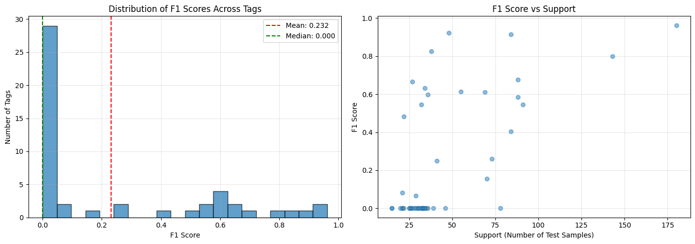 | 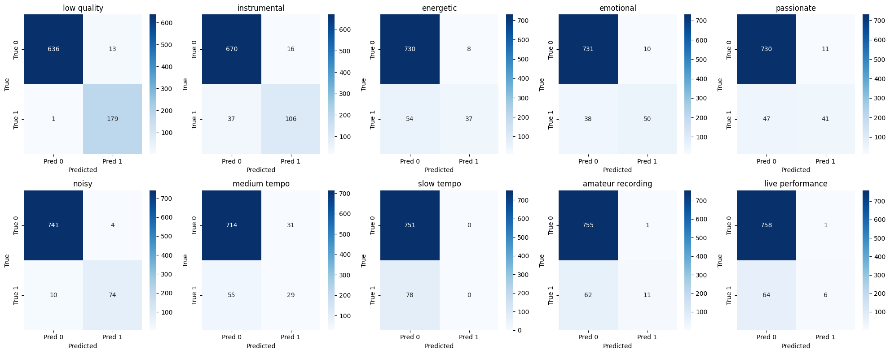 |

| Top & bottom tags | Train/val curve |
|---|---|
| 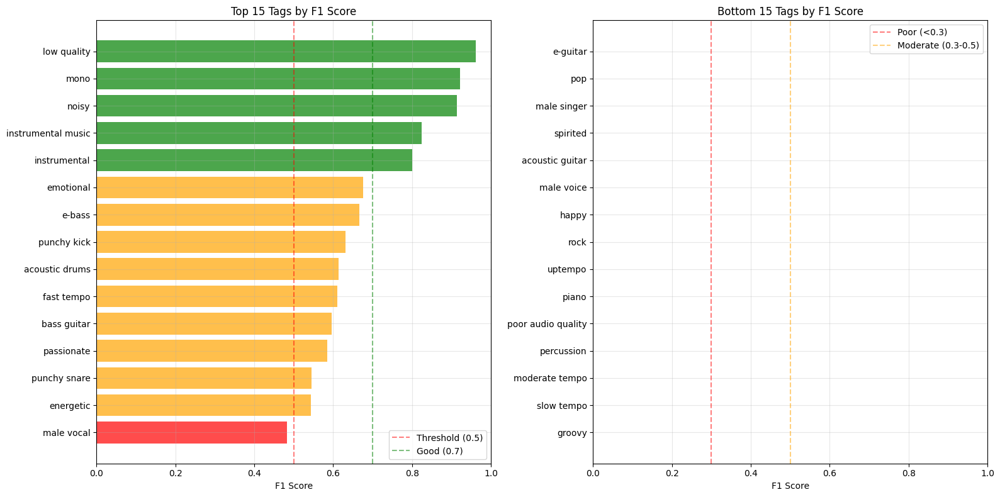 | 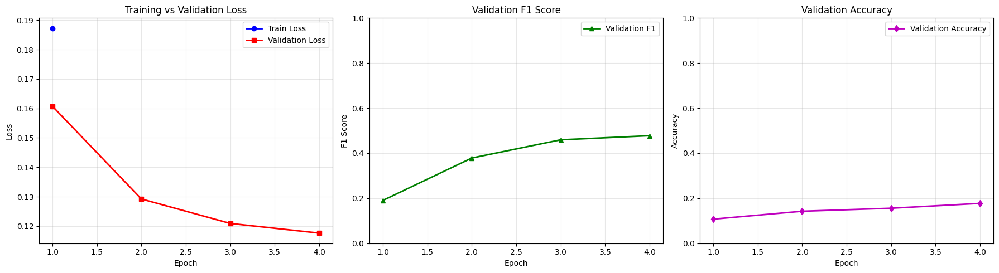 |

**Example prediction:** 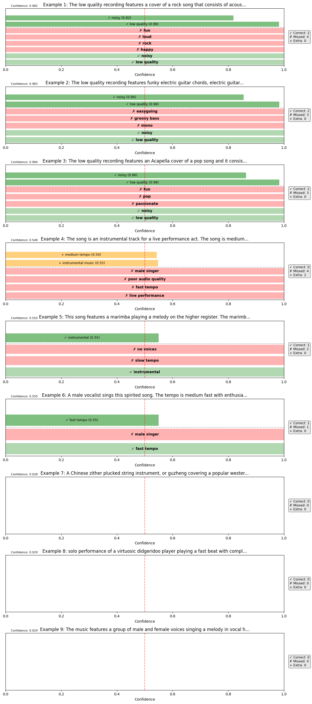

### Task 2 — Graph construction + CNN/GNN

| CNN model | GNN model |
|---|---|
| 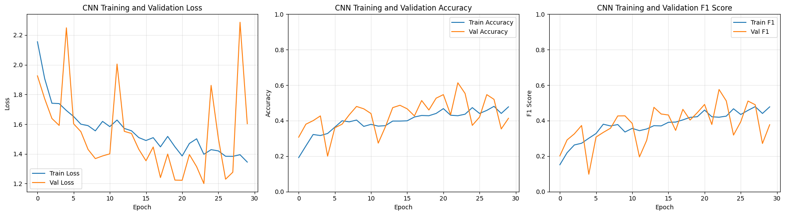 | 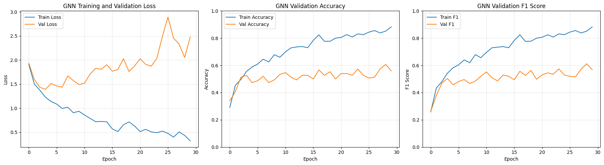 |

| Data distribution | Model evaluation |
|---|---|
| 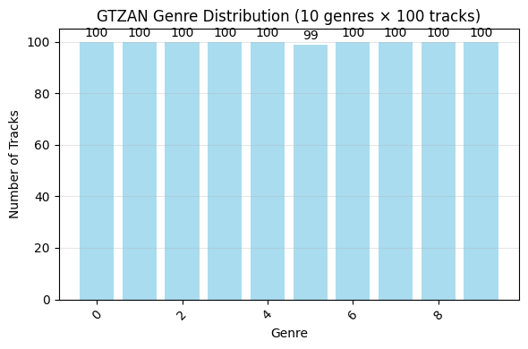 | 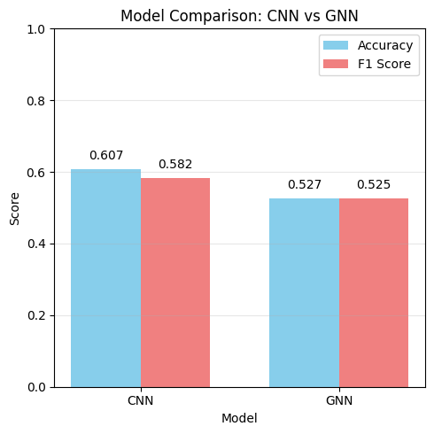 |

### Task 3 — Fusion model + ablation

| Ablation study | LR vs epoch |
|---|---|
| 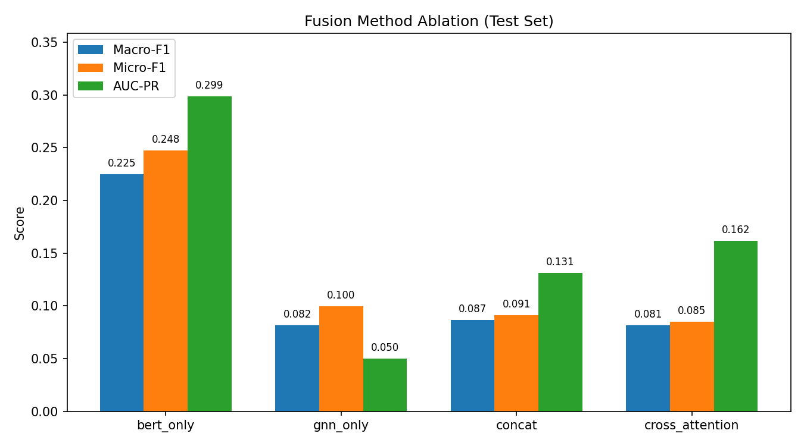 | 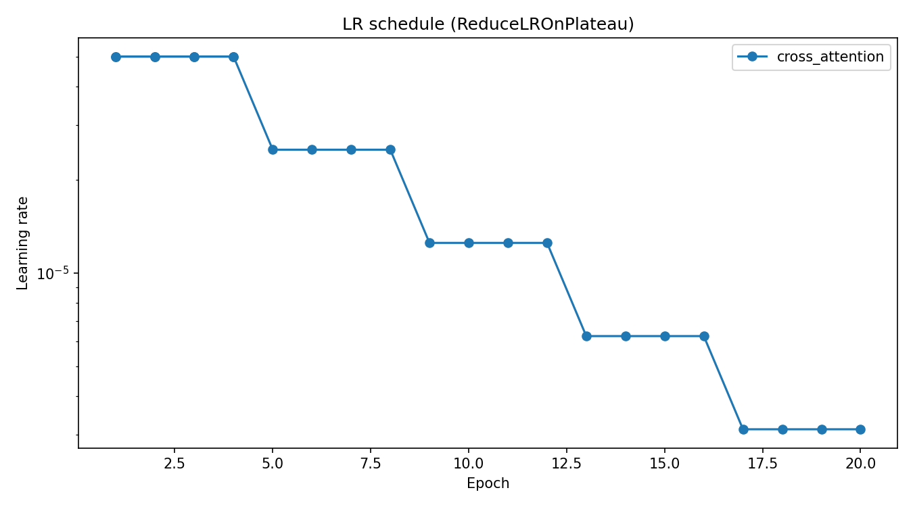 |

**Train/val curve:** 

## Notes
- **Raw audio (1.4 GB) is not included.** It lives in `data/raw/musiccaps/audio/` and is `.gitignore`d. Preprocessed graphs in `data/processed/graphs/` are everything the model and demo notebook need.
- The task notebooks use Colab-specific paths (`/content/...`). To run locally, adjust `PROJECT_ROOT` at the top of each notebook, or use the clean code in `src/`.
- All random seeds fixed for reproducibility (see notebooks for exact values).

## Environment

- Python 3.10
- PyTorch 2.0, PyTorch Geometric
- See [`requirements.txt`](requirements.txt) for pinned versions

## License

<MIT / course policy>
